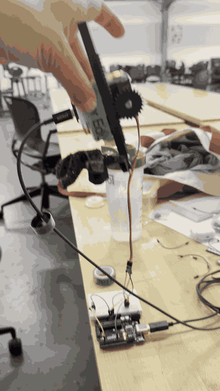

# Arduino Hail Mary



Inspired by the movie *Project Hail Mary*, this project simulates zero-gravity motion using Arduino. A 3D-printed Grace doll is attached to a linear actuator — the servo pushes the doll upward regardless of orientation, making Grace appear to float in zero-G.

Under the hood, an ESP32 with a 9-axis IMU sensor (LSM9DS1) detects tilt via BLE, a Python bridge forwards the data to an Arduino Uno, and the Uno drives a servo to keep the Grace always moving upward. A real-time web dashboard visualizes the sensor data and servo position live.

## System Overview

```
┌─────────────────────┐      BLE        ┌──────────────┐    USB Serial    ┌─────────────────┐
│  ESP32 + LSM9DS1    │ ─────────────►  │  bridge.py   │ ──────────────►  │  Arduino Uno    │
│  (Sensor Board)     │                 │  (laptop)    │                  │  + Servo Motor  │
└─────────────────────┘                 │              │                  └─────────────────┘
                                        │  WebSocket   │
                                        │      │       │
                                        └──────┼───────┘
                                               ▼
                                        ┌──────────────┐
                                        │  Browser     │
                                        │  Dashboard   │
                                        │  (HTML)      │
                                        └──────────────┘
```

`bridge.py` connects to the ESP32 via BLE and forwards sensor data to both the Uno (servo control) and the browser (live dashboard) via WebSocket.

**Alternatively**, the ESP32 can be plugged in via USB and the dashboard can read directly using Web Serial (no bridge needed, but no servo control).

## Hardware Required

| Component | Purpose |
|---|---|
| **ESP32** dev board | Reads sensor data, sends via BLE + USB |
| **LSM9DS1** 9-axis IMU | Accelerometer + Gyroscope sensor |
| **Arduino Uno** | Receives data, controls servo |
| **Servo motor** | Moves the doll via linear actuator |
| **Jumper wires** | Connections |

## Wiring

### ESP32 + LSM9DS1 (I2C)

| LSM9DS1 Pin | ESP32 Pin |
|---|---|
| VIN | 3.3V |
| GND | GND |
| SDA | GPIO 21 (default I2C SDA) |
| SCL | GPIO 22 (default I2C SCL) |

### Arduino Uno

| Component | Uno Pin |
|---|---|
| Servo signal wire | Pin 9 |
| Servo VCC | 5V (or external power for larger servos) |
| Servo GND | GND |

## Software Setup

### 1. Install Arduino Libraries

In Arduino IDE, go to **Sketch > Include Library > Manage Libraries** and install:

- `Adafruit LSM9DS1` (and its dependencies)
- `Servo` (built-in, usually pre-installed)

For ESP32 board support, add this URL in **File > Preferences > Additional Board Manager URLs**:
```
https://raw.githubusercontent.com/espressif/arduino-esp32/gh-pages/package_esp32_index.json
```
Then install "ESP32" from **Tools > Board > Board Manager**.

### 2. Install Python Dependencies

```bash
pip install bleak pyserial websockets
```

### 3. Upload Sketches

1. Connect the **ESP32** via USB. In Arduino IDE:
   - Select your ESP32 board under **Tools > Board**
   - Select the correct port under **Tools > Port**
   - Open `mar27 swipe_esp.ino` and upload

2. Connect the **Arduino Uno** via USB. In Arduino IDE:
   - Select **Arduino Uno** under **Tools > Board**
   - Select the correct port under **Tools > Port**
   - Open `mar27 swipe.ino` and upload

### 4. Configure bridge.py

Open `bridge.py` and update the Uno port name to match your system:

```python
UNO_USB_PORT = '/dev/cu.usbmodem1101'   # your Uno USB port
```

To find your port, run:
```bash
ls /dev/cu.*
```

On Windows, check **Device Manager > Ports (COM & LPT)** for COM port numbers.

## How to Use

### Full System (ESP32 > Bridge > Uno + Dashboard)

1. **Close Arduino IDE Serial Monitor** (it locks the port)
2. **Start a local web server** in the project folder:
   ```bash
   python -m http.server 9000
   ```
3. **Run the bridge** (in a separate terminal):
   ```bash
   python bridge.py
   ```
   You should see:
   ```
   Found: ESP32_Sensor (...)
   Uno connected: /dev/cu.usbmodem1101
   BLE connected!
   Bridge running!
   ```
4. **Open the dashboard** in Chrome:
   ```
   http://localhost:9000/mar27_monitoring.html
   ```
   The page auto-connects to bridge.py via WebSocket. Sensor values, charts, and the servo visualization will update in real time.

### USB-Direct Monitoring (ESP32 only, no servo)

If you just want to view sensor data without the Uno:

1. Plug the ESP32 into your laptop via USB
2. **Close Arduino IDE Serial Monitor**
3. Start a local web server and open the dashboard (same as above)
4. Click **"Connect USB (Web Serial)"** and select the ESP32 port

> Web Serial requires **Chrome** or **Edge** (not Safari/Firefox).

## How It Works

### Sensor (ESP32)

The ESP32 reads the LSM9DS1 sensor at 20Hz and sends 6 comma-separated values over both BLE and USB Serial:

```
ax,ay,az,gx,gy,gz
```

- `ax, ay, az` — Accelerometer (m/s²)
- `gx, gy, gz` — Gyroscope (dps)

The ESP32 advertises as `ESP32_Sensor` over BLE using the Nordic UART Service.

### Servo Logic (Uno)

The Uno determines orientation from the Z-axis accelerometer value:

| Condition | Meaning | Servo Target |
|---|---|---|
| `az < -2.0` | Sensor facing **up** | 180° (push doll up) |
| `az > 2.0`  | Sensor facing **down** | 0° (reverse direction, push doll up) |
| `-2.0 <= az <= 2.0` | Dead zone | Holds current position |

The servo moves gradually at 1°/15ms (~2.7 seconds for a full sweep) for smooth motion.

### Bridge (Python)

`bridge.py` connects to the ESP32 via BLE (using `bleak`) and:
- Forwards raw CSV data to the Uno over USB serial
- Parses the data into JSON and sends it to the browser via WebSocket (port 8765)

### Dashboard (HTML)

The web dashboard displays:
- Live accelerometer values (X, Y, Z)
- Live gyroscope values (GX, GY, GZ)
- **Servo visualization** — animated doll that mirrors the real servo position and movement speed
- Real-time line charts for accelerometer and gyroscope
- Debug log showing raw incoming data

## Troubleshooting

| Problem | Solution |
|---|---|
| `Failed to open serial port` | Close Arduino IDE Serial Monitor. Run `lsof /dev/cu.*` to check what's using the port. |
| `ESP32_Sensor not found` | Make sure the ESP32 is powered on and the BLE sketch is uploaded. |
| `programmer is not responding` | Stop bridge.py and close Serial Monitor before uploading sketches. |
| Graphs not updating | Check the Debug Log at the bottom of the page. Make sure bridge.py is running. |
| Servo not moving | Check that bridge.py is running and forwarding data to Uno. |
| `Web Serial not supported` | Use Chrome or Edge. Safari and Firefox do not support Web Serial. |
| Dashboard won't load / security error | Don't open the HTML file directly. Use `python -m http.server 9000` and access via `http://localhost:9000/`. |

## Files

| File | Description |
|---|---|
| `mar27 swipe_esp.ino` | ESP32 sketch — reads LSM9DS1, sends data via BLE + USB |
| `mar27 swipe.ino` | Arduino Uno sketch — receives data, controls servo |
| `bridge.py` | Python bridge — BLE > Uno (serial) + Browser (WebSocket) |
| `mar27_monitoring.html` | Real-time dashboard with servo visualization and charts |
